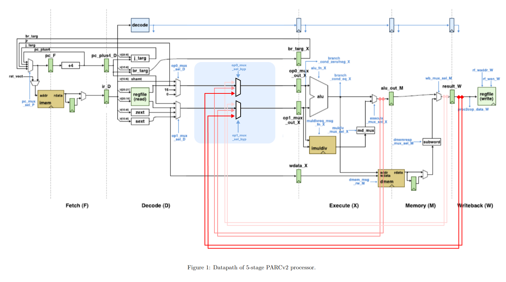
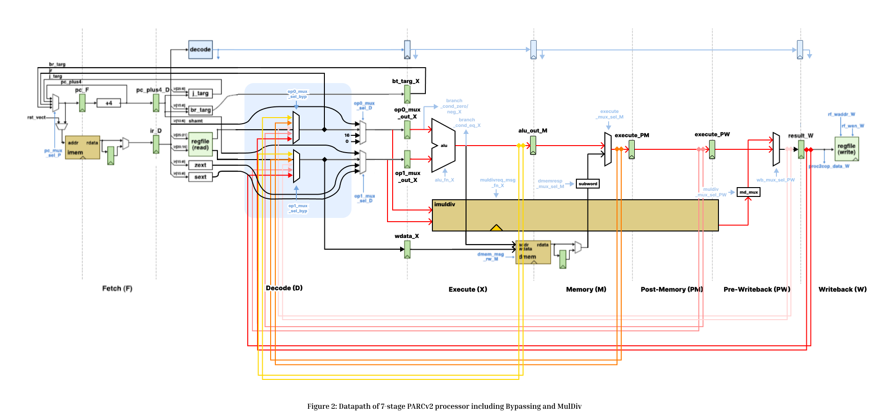
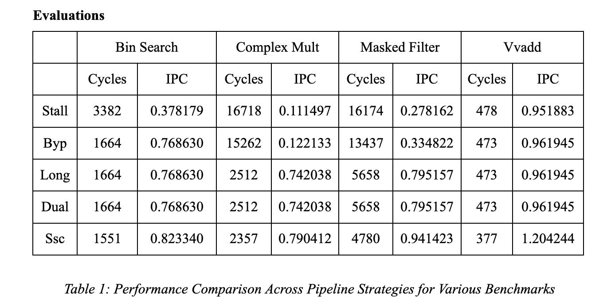
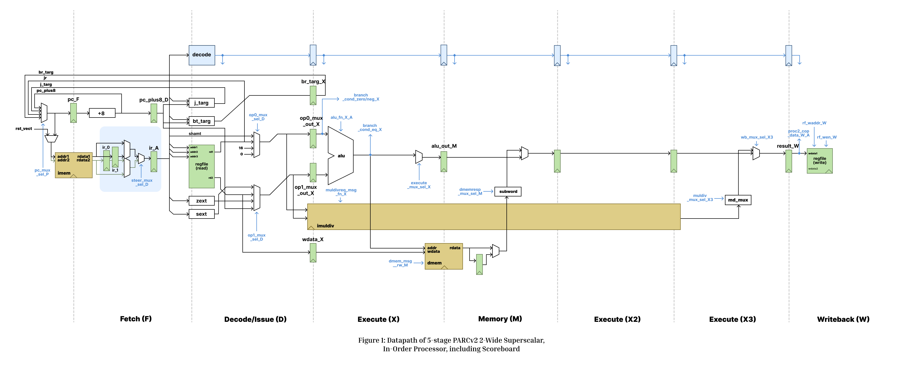
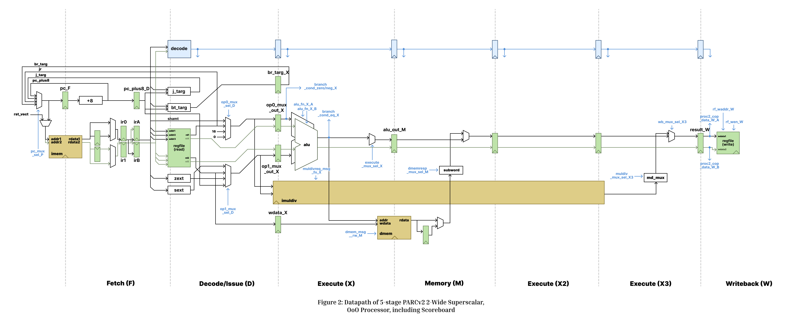

# Computer Architecture Projects

### Lab1: Iterative Integer Multiply/Divide Unit

This lab focuses on designing and implementing an iterative integer multiply/divide unit using Verilog HDL. The objective is to develop hardware that performs multiplication and division with remainder operations iteratively on 32-bit operands, producing a 64-bit result. The final deliverables include the designed Verilog modules: imuldiv-IntDivIteratice.v, and imuldiv-IntMulIteratice.v; unit tests, simulation results, and a comprehensive lab report.

### Lab2: Pipelined PARCv2 Processor

In this lab, we extend a pipelined PARCv1 processor into a full-featured PARCv2 design by implementing key performance enhancements. The primary objectives include upgrading the control unit to support the complete PARCv2 instruction set, incorporating bypassing logic to mitigate pipeline stalls, and integrating a pipelined multiplier/divider (MulDiv) unit. These enhancements collectively enable the processor to execute a broader range of instructions with improved efficiency by reducing cycle counts and minimizing the performance penalties associated with data hazards. This work not only deepens our understanding of advanced pipelining strategies but also lays the ground for further optimizations in modern processors.

### Lab3: Superscalar PARCv2 Processor

In this lab, we extend the pipelined PARCv2 processor from the previous lab into a two-wide superscalar processor. The project is divided into two main parts: first, implementing dual instruction fetch with single-issue logic, and second, enabling full dual-issue execution with appropriate control, steering, and scoreboard logic to manage pipeline constraints and data hazards. The updated processor fetches two instructions per cycle and issues them to corresponding functional units A and B through a combined decode-issue stage. Unit A remains fully functional as in the previous implementation, while unit B supports only simple ALU instructions. In the absence of hazards or dependencies, which we handle since the register file will not, the processor can execute two instructions per cycle in the best case. For some tests and benchmarks, the speedups were present but not significant. For the masked filter and vvadd benchmarks, the improvement was a nearly 25% speedup, showing significant IPC improvement over single-issue pv2long implementations (Table 1). These results underscore how increased parallelism and careful hazard management contribute to throughput gains, while also illustrating tradeoffs with complexity and limitations due to dependency stalls and structural hazards in more complex programs.

