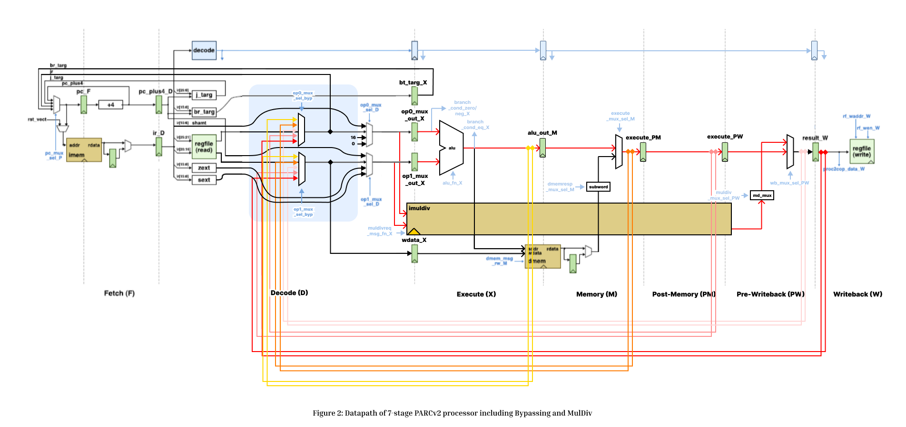

# Computer Architecture Projects

### Lab1: Iterative Integer Multiply/Divide Unit

This lab focuses on designing and implementing an iterative integer multiply/divide unit using Verilog HDL. The objective is to develop hardware that performs multiplication and division with remainder operations iteratively on 32-bit operands, producing a 64-bit result. The final deliverables include the designed Verilog modules: imuldiv-IntDivIteratice.v, and imuldiv-IntMulIteratice.v; unit tests, simulation results, and a comprehensive lab report.

### Lab2: Pipelined PARCv2 Processor

In this lab, we extend a pipelined PARCv1 processor into a full-featured PARCv2 design by implementing key performance enhancements. The primary objectives include upgrading the control unit to support the complete PARCv2 instruction set, incorporating bypassing logic to mitigate pipeline stalls, and integrating a pipelined multiplier/divider (MulDiv) unit. These enhancements collectively enable the processor to execute a broader range of instructions with improved efficiency by reducing cycle counts and minimizing the performance penalties associated with data hazards. This work not only deepens our understanding of advanced pipelining strategies but also lays the ground for further optimizations in modern processors.

### Lab3: Superscalar PARCv2 Processor

In this lab, we create a two-wide superscalar in-order processor. We are provided with a
working datapath of such processor, and we add the processor control logic, instruction steering
logic, and a scoreboard to enable your processor to properly execute two instructions per cycle.

